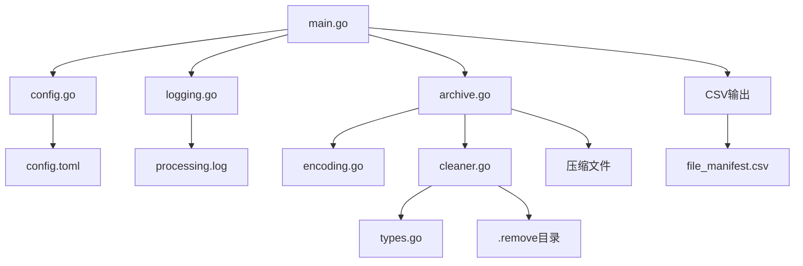

# Clean Extract 架构设计

## 模块化架构

项目采用模块化设计，将原来的721行单文件重构为7个专门模块：

```
clean-extract/
├── main.go          # 程序入口控制 (79行)
├── types.go         # 数据结构定义 (35行)
├── config.go        # 配置管理 (23行)
├── logging.go       # 日志系统 (19行)
├── encoding.go      # 中文编码处理 (64行)
├── cleaner.go       # 文件清理逻辑 (168行)
└── archive.go       # 压缩文件处理 (161行)
```

## 模块职责

### 1. main.go - 程序入口
**职责**：流程控制和协调
- 命令行参数解析
- 初始化配置和日志系统
- 协调各模块执行
- CSV输出处理

**核心函数**：
- `main()` - 主流程控制

### 2. types.go - 数据结构
**职责**：核心数据模型定义
- 配置结构体
- 清单记录结构体
- 统计信息结构体
- 全局变量声明

**核心结构**：
- `Config` - 配置管理
- `ManifestEntry` - 文件清单
- `ProcessStats` - 处理统计
- 全局变量 - 日志记录器等

### 3. config.go - 配置管理
**职责**：配置文件加载和管理
- TOML配置文件解析
- 配置验证和默认值处理
- 优先级策略管理

**核心函数**：
- `loadConfig()` - 配置加载

### 4. logging.go - 日志系统
**职责**：日志记录和管理
- 双重日志系统（文件+控制台）
- 不同级别的日志输出
- 日志文件管理

**核心函数**：
- `setupLogging()` - 日志初始化

### 5. encoding.go - 中文编码处理
**职责**：文件名编码转换
- 智能中文编码检测
- GB18030/GBK编码转换
- 乱码识别和处理

**核心函数**：
- `decodeChineseFilename()` - 中文解码
- `containsGarbled()` - 乱码检测

### 6. cleaner.go - 文件清理
**职责**：文件优先级处理和清理
- 文件分组和优先级排序
- 文件移动和删除
- 空目录清理

**核心函数**：
- `cleanDirectory()` - 目录清理
- `moveToRemove()` - 文件移动
- `getFilePriority()` - 优先级计算

### 7. archive.go - 压缩文件处理
**职责**：各种压缩格式的解压处理
- ZIP/RAR/ISO格式支持
- 大文件处理优化
- 7z命令集成

**核心函数**：
- `processArchive()` - 压缩文件处理
- `extractZip()`/`extractRar()`/`extractIso()` - 解压函数

## 数据流架构



## 设计原则

### 1. 单一职责原则
每个模块只负责一个特定功能领域，职责边界清晰。

### 2. 依赖倒置原则
高层模块不依赖低层模块，都依赖于抽象接口。

### 3. 开闭原则
对扩展开放，对修改封闭。新增压缩格式无需修改现有代码。

### 4. 接口隔离原则
不同模块通过明确的函数接口交互，避免过度耦合。

## 性能考虑

### 1. 内存管理
- 串行处理，避免同时加载多个大文件
- 流式文件处理，减少内存占用
- 及时释放文件句柄和资源

### 2. 磁盘I/O优化
- 批量文件操作，减少磁盘寻址
- 智能跳过已处理内容
- 异步日志写入

### 3. 错误处理
- 优雅降级，部分失败不影响整体处理
- 详细错误记录，便于问题定位
- 自动重试机制

## 扩展性设计

### 1. 新压缩格式支持
- 在`archive.go`中添加新的解压函数
- 更新`ARCHIVE_EXTS`映射
- 在`processArchive`中添加case分支

### 2. 新清理策略
- 扩展`Config`结构体添加策略参数
- 在`cleaner.go`中实现新算法
- 更新配置文件格式

### 3. 新输出格式
- 在`main.go`中添加新的输出处理
- 保持现有接口不变
- 支持命令行参数选择输出格式

## 安全性考虑

### 1. 路径安全
- 防止路径遍历攻击
- 绝对路径验证
- 文件权限检查

### 2. 资源限制
- 文件大小限制
- 处理超时机制
- 磁盘空间检查

### 3. 错误隔离
- 单个文件处理失败不影响其他文件
- 异常恢复机制
- 资源清理保证