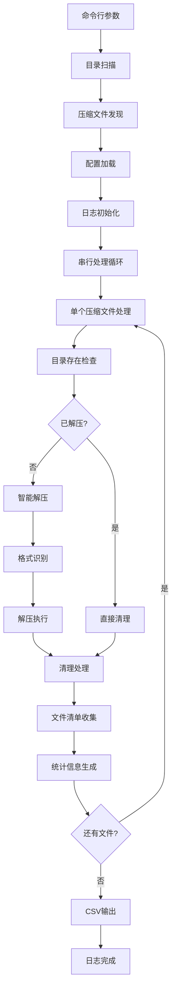

# Clean Extract 数据流文档

## 数据流概述

Clean Extract 的处理流程是一个线性的数据处理管道，从输入目录扫描开始，到最终的CSV文件输出结束。整个过程遵循单一数据流原则，确保数据的一致性和可追溯性。

## 整体数据流架构



## 详细数据流分析

### 1. 初始化阶段

#### 1.1 参数验证流
```
输入: os.Args[1] (目录路径)
    |
    v
验证: 参数数量检查
    |
    v
输出: rootDir (string) | 错误退出
```

#### 1.2 配置加载流
```
输入: config.toml 文件
    |
    v
解析: TOML 解析器
    |
    v
验证: 逻辑完整性检查
    |
    v
处理: 默认值填充
    |
    v
输出: config 全局变量
```

#### 1.3 日志系统初始化流
```
输入: 工作目录
    |
    v
创建: processing.log 文件
    |
    v
初始化: fileLogger (文件日志)
    |
    v
初始化: consoleLogger (控制台日志)
    |
    v
输出: 双重日志系统
```

### 2. 文件发现阶段

#### 2.1 目录扫描流
```
输入: rootDir (根目录路径)
    |
    v
遍历: filepath.Walk()
    |
    v
过滤: ARCHIVE_EXTS[ext] 检查
    |
    v
收集: archives []string
    |
    v
输出: 压缩文件列表
```

**扫描规则**:
- 递归遍历所有子目录
- 只检查文件扩展名
- 不区分大小写匹配
- 支持的扩展名: `.zip`, `.rar`, `.iso`

### 3. 核心处理阶段

#### 3.1 单文件处理流
```
输入: archivePath (单个压缩文件路径)
    |
    v
日志: 开始处理记录
    |
    v
计算: extractDir = 去扩展名的路径
    |
    v
检查: dirExistsAndHasContent(extractDir)
    |
    v
分支: 已存在/未存在
```

#### 3.2 解压处理流
```
输入: archivePath, extractDir
    |
    v
识别: filepath.Ext(archivePath)
    |
    v
分发: 根据扩展名选择解压器
    |
    v
执行: extractZip/extractRar/extractIso
    |
    v
处理: 中文文件名解码
    |
    v
输出: 解压后的文件树
```

#### 3.3 清理处理流
```
输入: extractDir (解压目录)
    |
    v
收集: filepath.Walk() 所有文件
    |
    v
分组: 基础文件名 + 目录路径
    |
    v
过滤: isKeepExtension() 检查
    |
    v
排序: getFilePriority() 优先级排序
    |
    v
处理: 保留最高优先级，移动其他文件
    |
    v
清理: 删除空目录
    |
    v
输出: 清理后的目录结构
```

### 4. 数据收集阶段

#### 4.1 清单生成流
```
输入: 清理后的目录结构
    |
    v
遍历: filepath.Walk()
    |
    v
过滤: 只处理文件（跳过目录）
    |
    v
转换: 生成 ManifestEntry
    |
    v
计算: 绝对路径, 源文件信息
    |
    v
收集: manifestEntries []ManifestEntry
```

#### 4.2 统计信息流
```
输入: 处理过程数据
    |
    v
计算: 总文件数量
    |
    v
计算: 保留文件数量
    |
    v
计算: 移除文件数量
    |
    v
生成: ProcessStats 结构
    |
    v
输出: 处理统计信息
```

### 5. 输出阶段

#### 5.1 CSV生成流
```
输入: manifestEntries []ManifestEntry
    |
    v
创建: file_manifest.csv 文件
    |
    v
写入: CSV 表头
    |
    v
遍历: 所有清单条目
    |
    v
格式化: CSV 行数据
    |
    v
写入: 文件内容
    |
    v
输出: CSV 文件
```

#### 5.2 日志输出流
```
输入: 处理过程中的各种事件
    |
    v
分流: fileLogger / consoleLogger
    |
    v
格式化: 时间戳 + 消息 (fileLogger)
    |
    v
格式化: 纯消息 (consoleLogger)
    |
    v
输出: processing.log + 控制台
```

## 关键数据结构流

### Config 数据流
```
TOML文件 → toml.Unmarshal() → Config结构体 → 全局变量
    |
    v
验证: KeepExtensions 非空
    |
    v
处理: Priority 默认值
    |
    v
使用: 各模块读取配置
```

### ManifestEntry 数据流
```
文件系统遍历 → 路径处理 → ManifestEntry创建 → 数组收集 → CSV输出
    |
    v
字段映射:
Filename          ← info.Name()
Filepath          ← filepath.Abs()
SourceArchiveName ← filepath.Base()
SourceArchivePath ← filepath.Abs()
```

### ProcessStats 数据流
```
处理过程 → 计数器更新 → ProcessStats生成 → 日志输出
    |
    v
统计字段:
TotalFiles   ← 处理的文件总数
KeptFiles    ← 保留的文件数量
RemovedFiles ← 移除的文件数量
Success      ← 处理成功状态
ErrorMsg     ← 错误信息（如有）
```

## 错误处理数据流

### 错误分类处理流
```
错误发生 → 错误分类 → 处理策略 → 记录日志 → 继续/退出
    |
    v
致命错误: 配置错误, 权限错误 → 程序退出
    |
    v
文件错误: 单个文件处理失败 → 跳过继续
    |
    v
警告: 非关键问题 → 记录继续
```

### 错误恢复流
```
解压失败 → 检查目录内容 → 手工解压检测 → 继续清理
    |
    v
文件移动失败 → 记录错误 → 跳过文件 → 继续处理
    |
    v
编码转换失败 → 使用原始名称 → 继续处理
```

## 性能优化数据流

### 内存管理流
```
文件发现 → 串行处理 → 及时释放 → 内存控制
    |
    v
策略:
- 不同时加载多个压缩文件
- 流式文件处理
- 及时关闭文件句柄
```

### 磁盘I/O优化流
```
批量操作 → 减少寻址 → 顺序处理 → I/O优化
    |
    v
技术:
- 文件系统缓存利用
- 批量文件移动
- 智能跳过已处理内容
```

## 数据一致性保证

### 事务性处理
```
单个文件处理 → 原子操作 → 一致性保证
    |
    v
原则:
- 要么完全成功，要么完全失败
- 中间状态不影响其他文件
- 错误恢复机制
```

### 数据完整性
```
输入验证 → 处理验证 → 输出验证
    |
    v
检查点:
- 配置文件格式验证
- 文件路径有效性检查
- 输出文件完整性验证
```

## 监控和审计数据流

### 处理监控流
```
处理开始 → 进度记录 → 状态更新 → 完成报告
    |
    v
监控指标:
- 处理文件数量
- 成功/失败比例
- 处理时间统计
```

### 审计跟踪流
```
每个操作 → 详细记录 → 审计日志 → 追踪能力
    |
    v
审计信息:
- 操作时间戳
- 操作类型
- 文件路径
- 操作结果
```

这个数据流设计确保了处理过程的可预测性、可监控性和可维护性，符合Linus式的设计理念：简单、可靠、高效。